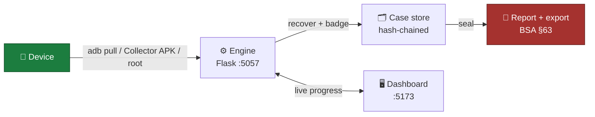

<div align="center">

# 🛡️ SNAGR

**Android Rapid Evidence Triage & Forensic Preview**

Seized phone → readable evidence preview in minutes, not days.
Minimally-invasive. Fully-logged. Never claims more than it did.

`ERH26_PS_02` · Python · Flask · Electron · React · TypeScript · Kotlin · SQLite

</div>

---

## The pitch

On-scene officers can't tell, in the moment, whether a seized Android phone holds the
case-breaking message — or nothing at all. Commercial triage tools are Windows-locked,
license-gated, and often quietly overclaim ("read-only acquisition" doesn't exist for
mobile — SWGDE says so). **SNAGR** pulls what's reachable non-root in minutes, recovers
deleted rows where physics allows it, and logs every device touch to a hash-chained audit
trail — so the report is something you can actually stand behind.

## Highlights

- 🔓 **Tiered acquisition** — Tier 0 (zero touch) → Tier 1 (sideloaded helper) → Tier 2 (root), every tier opt-in and logged
- 🧬 **Deleted-record recovery** — WAL / freelist / freeblock / rollback-journal carving, confidence-badged (Live / Recovered / Carved / Deletion-Detected)
- 💬 **Multi-app coverage** — WhatsApp, Telegram, Instagram, Snapchat, SMS, browser history — including their deleted messages
- 🗺️ **Location & social graph** — EXIF/GPS trace, cell-tower history, cross-channel comms graph
- 📡 **Radio artifacts** — Wi-Fi credentials & saved-vs-joined networks, Bluetooth pairings *and* file-transfer history, hotspot posture
- 🚦 **Traffic-light verdict** — RED/AMBER/GREEN scorecard built for a five-minute field decision
- 📜 **Court-shaped report** — NIST/SWGDE-aligned, BSA 2023 §63 certificate, sealed SHA-256 export
- 🧠 **Case intelligence** — plain-language brief → ontology-ranked collection plan, offline by default
- 🔎 **Local RAG, on your machine** — precedent retrieval blends BM25 with a local embedding model under Ollama; case text never leaves the workstation, and the plan records which of the two actually ran
- 🚧 **Per-dataset capability states** — every view says whether its data was collected, checked-and-empty, gated off, unreachable, or not built yet
- 📴 **Works with zero phone** — full pipeline demoable against a synthetic mock corpus

Running through all of it is one rule: **absent ≠ inaccessible, and unverified ≠ clean.** A
thing we could not read is reported as unreadable, never as not there — including in the
dashboard, where an empty view names which of the four kinds of "empty" it is rather than
rendering a blank panel.

## How it flows



## Quick start (no phone required)

```bash
./run.sh          # venv + deps + mock corpus + engine :5057 + dashboard :5173
```

Sign in (`examiner` / `snagr` by default — override in `engine/.env`), pick the mock
device, click **Begin Acquisition**. Or step by step:

```bash
cd engine && python3 -m venv .venv && source .venv/bin/activate
pip install -r requirements.txt && cp .env.example .env
python tools/make_corpus.py _corpus/device_A     # synthetic device, no phone involved
python -m triage.server --port 5057

cd app && npm install && npm run dev             # new terminal → localhost:5173
```

## Against a real phone

USB debugging on, device authorised, screen unlocked. Tier 0 needs nothing else; Tier 1
sideloads [the collector APK](apk/README.md); Tier 2 needs root and is always opt-in.

```bash
adb devices                                       # confirm it is authorised
cd engine && source .venv/bin/activate
python -m triage.cli devices                      # what the engine can see

# Tier 0 only — no install, no root
python -m triage.cli acquire --serial <SERIAL> \
    --case CASE01 --examiner "Your Name" --authority "<warrant ref>"

# Add Tier 1 (installs + uninstalls the helper) and Tier 2 (root) as the case allows
python -m triage.cli acquire --serial <SERIAL> --case CASE01 --examiner "Your Name" \
    --tier1-collect-all \
    --tier2-wifi --tier2-bt-config --tier2-browser-history --tier2-whatsapp-backup
```

`python -m triage.cli acquire --help` lists every tier flag. The dashboard drives the same
pipeline with live progress if you'd rather click.

## Repo layout

| | |
|---|---|
| `engine/` | Python acquisition + recovery + reporting. `triage/pipeline.py` is the spine |
| `engine/triage/parsers/` | One module per artifact type — the bulk of the forensic logic |
| `engine/triage/recovery/` | SQLite carving: freelist, freeblocks, unallocated, WAL, journals |
| `app/` | Electron + React dashboard (Vite, TypeScript) |
| `apk/` | Kotlin Tier-1 collector, sideloaded and then removed |
| `docs/` | The reference docs linked below |

Building and testing each half:

```bash
cd engine && python -m pytest tests/ -q      # 1101 tests, no device needed
cd apk && ./gradlew assembleDebug            # needs the Android SDK
cd app && npx tsc --noEmit                   # dashboard typecheck
```

## 📚 Full documentation

| | |
|---|---|
| [**Capabilities**](docs/CAPABILITIES.md) | Every verified feature vs. its commercial equivalent |
| [**Architecture**](docs/ARCHITECTURE.md) | Diagrams, workflow, folder structure, stack rationale |
| [**API reference**](docs/API_REFERENCE.md) | Every route, auth rule, Socket.IO event |
| [**Database**](docs/DATABASE.md) | Schema, per-case file layout, example payloads |
| [**Setup & deployment**](docs/SETUP.md) | Full install, deps, env vars, packaging gaps |
| [**Network artifacts**](docs/NETWORK_ARTIFACTS.md) | Wi-Fi, Bluetooth, USB & hotspot — what the device stores and what we can read |
| [**Notes**](docs/NOTES.md) | Forensic soundness, WhatsApp module deep-dive, known gaps |

## Reality check

Not production-ready as a court-grade instrument yet, and says so on every report. No
slack-space carving, no lock-screen bypass, no Signal decryption — see
[`docs/NOTES.md`](docs/NOTES.md) for the full honesty ledger, including what's built but
deliberately not wired up.

---

<div align="center">

**1101 tests passing** · Runs fully offline · No account, no cloud, no telemetry

</div>
