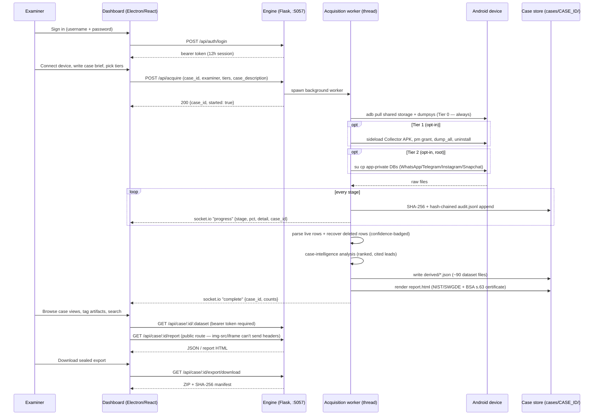
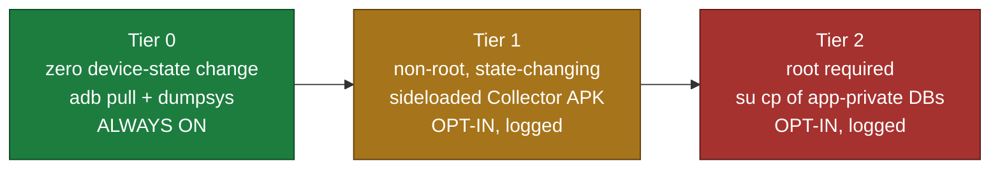
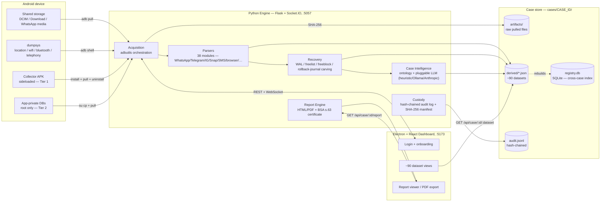
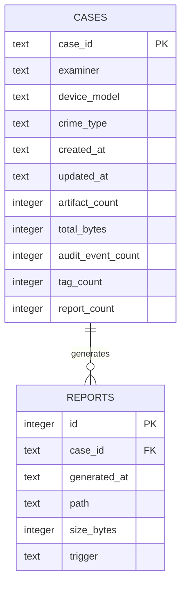

# SNAGR — Android Rapid Evidence Triage & Forensic Preview Tool

**Problem statement:** ERH26_PS_02 (Digital Forensics)

A field-deployable, forensically-minded tool that gives an on-scene officer a readable
**preview** of a connected Android device's high-value evidence — messages, recovered
deleted chats, contacts, calls, media, and locations — in minutes, in a
**minimally-invasive, fully-logged** manner that preserves chain of custody and does not
prejudice the later full laboratory examination.

> **Design honesty first.** This tool never claims "read-only" acquisition — SWGDE 18-F-003
> is explicit that no write-blocking exists for mobile devices. Instead it logs *every*
> device interaction to an append-only, hash-chained audit trail and labels every recovered
> row with its confidence and byte-level provenance. See [`docs/IMPLEMENTATION_PLAN.md`](docs/IMPLEMENTATION_PLAN.md)
> and [`engine/docs/PRODUCTION_READINESS.md`](engine/docs/PRODUCTION_READINESS.md).

---

## Table of contents

1. [What it does (verified, working)](#what-it-does-verified-working)
2. [End-to-end workflow](#end-to-end-workflow)
3. [System architecture](#system-architecture)
4. [Project folder structure](#project-folder-structure)
5. [Setup & installation](#setup--installation)
6. [Dependencies & requirements](#dependencies--requirements)
7. [API documentation](#api-documentation)
8. [Database / data model](#database--data-model)
9. [Deployment](#deployment)
10. [Tests](#tests)
11. [Forensic soundness notes](#forensic-soundness-notes)
12. [WhatsApp recovery module (deep dive)](#whatsapp-recovery-module-deep-dive)
13. [Known gaps & unwired scaffolding](#known-gaps--unwired-scaffolding)

---

## What it does (verified, working)

| Capability | Status | Comparable commercial feature |
|---|---|---|
| Tier-0 acquisition (adb pull of shared storage, dumpsys location) | ✅ | UFED logical extraction |
| Acquisition throughput metric (MB/min) | ✅ | MDI "up to 4GB/min" |
| Manual screen capture (read-only framebuffer) | ✅ | Oxygen/MDI screenshot mode |
| Per-artifact SHA-256 hashing + append-only, hash-chained audit trail | ✅ | UFED chain-of-custody |
| **SQLite deleted-record recovery** (freelist / freeblock / unallocated / WAL carving) | ✅ | MDI/Cellebrite deleted-chat recovery |
| Multi-app messages: WhatsApp export, Telegram/app-DB, SMS | ✅ | Deleted chat from WhatsApp/Telegram/Signal |
| Browser history (Chromium) + deleted-URL recovery | ✅ | — |
| 4-tier confidence labelling (Live / Recovered-Verified / Carved-Partial / Deletion-Detected) | ✅ | carved-data flagging |
| **Communication social graph** (link analysis across channels) | ✅ | Oxygen social-graph visualization |
| **Traffic-light triage verdict** (RED/AMBER/GREEN + scorecard) | ✅ | Cyacomb traffic-light interface |
| **On-scene artifact tagging / bookmarking** | ✅ | MDI on-scene tagging |
| **Global cross-artifact search** | ✅ | search-everything |
| EXIF GPS + dumpsys last-known-location (offline map) | ✅ | location mapping |
| Contacts / call-log parsing (Tier-1 helper APK output) | ✅ | agent-based logical extraction |
| Keyword + known-hash flagging | ✅ | Cyacomb known-content detection |
| Cross-artifact timeline reconstruction | ✅ | timeline view |
| **Notification history parser** (`dumpsys notification --history`) | ✅ | device activity analysis |
| **Bluetooth device history** (`dumpsys bluetooth_manager`) | ✅ | connected devices analysis |
| **Cell tower history** (`dumpsys telephony.registry`) | ✅ | location data analysis |
| Forensic Preview Dashboard (Electron + React), live progress, ~90 dataset views | ✅ | MDI field dashboard |
| NIST/SWGDE-aligned HTML report + **BSA 2023 s.63** Schedule certificate (Part A/B, dual signature) | ✅ | court-ready reporting |
| **Sealed evidence-package export** (ZIP + SHA-256 verification manifest) | ✅ | evidence export |
| Runs **with no phone** via a synthetic mock corpus (dev + demo fallback) | ✅ | — |
| **Sign-in gate** — single-examiner bearer-token auth in front of the dashboard/API | ✅ | — |

### New in v0.2 — expanded collection & app coverage

| Capability | Tier | Comparable commercial feature |
|---|---|---|
| **Collector APK `dump_all`** — one action captures everything below, then self-uninstalls | 1 (non-root) | Oxygen Android Agent |
| **MediaStore inventory** — every media file's metadata (size, `date_taken`, owner app, dimensions) without pulling the files | 1 | media catalogue before selective pull |
| **Trashed / favorite media detection** (`IS_TRASHED` / `IS_FAVORITE`) + EXIF GPS via `ACCESS_MEDIA_LOCATION` | 1 | recycle-bin / geotag surfacing |
| **Installed-app inventory** with investigative classification (messaging / crypto / dating / browser) | 1 | UFED installed applications |
| **Vault / anti-forensic app detection** (AppLock, Calculator Vault, hiders) | 1 | AXIOM "potentially unwanted apps" |
| **Accounts** (Google / WhatsApp / Telegram / Snapchat identities via AccountManager) | 1 | User Accounts |
| **Calendar events**, **app-usage telemetry** | 1 | Organizer / app usage |
| **Instagram Direct recovery** — `direct.db` live + deleted DMs, µs timestamps, + DYI-export ingest | 2 (root/image) | Instagram `direct.db` decode |
| **Snapchat recovery** — `arroyo.db` (schema-less protobuf), WAL/freelist ephemeral carve | 2 (root/image) | arroyo.db decode |
| **Dynamic App Finder** — auto-classifies chat tables in *unknown* app SQLite DBs | 0–2 | Cellebrite App Genie / Magnet Dynamic App Finder |

Where we deliberately **don't** claim parity (and say so, honestly): cloud extraction,
lock-screen bypass, physical/chip-off imaging, and defeating Signal's hardware-backed
Keystore — none are achievable non-root in scope. See `docs/IMPLEMENTATION_PLAN.md` §0.

### New in v0.3 — integrity, encryption posture, and persistent artifacts

Driven by a deep-research + adversarial-audit pass; the full findings live in
[`engine/docs/PRODUCTION_READINESS.md`](engine/docs/PRODUCTION_READINESS.md).

| Capability | Tier | Why it matters |
|---|---|---|
| **FBE / AFU-BFU encryption posture** determined before any root pull | 0 | *Root is not decryption.* Reports "present, encrypted, inaccessible (BFU)" instead of "not found" |
| **Tamper-evident audit log** — every entry hash-chained to its predecessor | — | An edited/reordered/deleted audit line breaks verification at a known line number |
| **Post-acquisition device snapshot + verified Tier-1 teardown** | 1 | "Unverified" is a distinct verdict from "clean" |
| **Deletion detected as its own evidence class** | 0–2 | Rendered apart from carved content, false-positive causes listed |
| **SQLite overflow-page chains** followed during carving | 0–2 | Long messages no longer silently truncated |
| **Rollback-journal (`-journal`) recovery** alongside WAL | 0–2 | Pre-deletion page images for non-WAL databases |
| **Non-root live Wi-Fi / Bluetooth bond store / App presence & execution** | 0/2 | The realistic non-root/root surface, honestly scoped |
| **Structural anti-forensics** (work profile, dual-app clone, factory-reset trace) | 2 | Observations only — every finding lists innocent explanations |
| **Tool self-validation** — known-answer report + CFTT coverage matrix, per acquisition | — | Includes a deliberate negative control that *must* fail |

---

## End-to-end workflow

The full path from "plug in a phone" to "sealed, court-formatted evidence package":



Escalating invasiveness is the core abstraction — every artifact is tagged with the tier
that produced it, and Tier 1/2 are opt-in with every skip logged with a reason:



---

## System architecture



**Why this stack:**
- **Electron + React/TS, not Next.js** — a native desktop tool needs direct USB/ADB access,
  must run fully offline in an interrogation room, and packages as a standalone executable.
- **Python/Flask as the engine, not Node/Go** — every forensic library that matters here
  (ALEAPP, SQLite carving, `adbutils`) is Python or trivially subprocess-callable from it.
- **Per-case SQLite/JSON on disk, no server database** — the tool has to work with zero
  network dependency at a crime scene. `registry.db` is a rebuildable cache, not the source
  of truth — the case folder is.

---

## Project folder structure

```
Digital forensic tool/
├── README.md                      # this file
├── run.sh                         # one-command demo launcher (venv + corpus + engine + dashboard)
├── DEMO_CHECKLIST.md / ps02_team_roadmap.md
├── docs/
│   └── IMPLEMENTATION_PLAN.md     # 30-day plan + feasibility research
│
├── engine/                        # Python forensic engine (the core)
│   ├── requirements.txt
│   ├── .env.example                # copy → .env for SNAGR_AUTH_USER/PASS
│   ├── docs/PRODUCTION_READINESS.md
│   ├── tools/                      # make_corpus.py (synthetic device generator) + 4 more
│   ├── tests/                      # pytest suite — 1007 tests
│   ├── security/ analytics/ integration/ advanced_forensics/   # ⚠ present, unwired — see Known Gaps
│   └── triage/                     # the actual engine package
│       ├── server.py               # Flask + Socket.IO app, all API routes
│       ├── pipeline.py             # stage orchestration — run_acquisition()
│       ├── custody.py              # Case class — chain-of-custody, audit, manifest
│       ├── registry.py             # cross-case SQLite registry
│       ├── config.py / models.py / cli.py / adb.py / hashing.py
│       ├── acquire/                # base.py, mock.py, real.py — acquisition backends
│       ├── parsers/                # 38 files — whatsapp_db.py, telegram.py, instagram.py, snapchat.py, sms.py, wifi.py, exif.py …
│       ├── recovery/                # deep_sqlite.py, sqbrite.py, sqlite_recovery.py
│       ├── forensics/               # 48 files — audit_chain.py, bsa_certificate.py, comm_graph.py, hash_verification.py …
│       ├── intel/                   # llm.py, planner.py, ontology.py, knowledge_graph.py, casebank.py + data/case_studies.jsonl
│       ├── report/                  # html_report.py, exporter_pdf.py, exporter_word.py, exporter_csv.py
│       ├── validation/              # cftt.py, harness.py, swgde.py — self-validation harness
│       └── notifications/           # ⚠ present, unwired — see Known Gaps
│
├── app/                            # Electron + React + TypeScript + Tailwind dashboard
│   ├── package.json / vite.config.ts / tailwind.config.js
│   ├── electron/                    # main.cjs, preload.cjs, pdf/pdfRenderer.cjs (Playwright)
│   └── src/
│       ├── App.tsx / main.tsx / index.css
│       ├── components/              # Sidebar.tsx, ChatView.tsx, GlobalSearch.tsx, RiskCard.tsx …
│       ├── lib/                     # api.ts (fetch client + auth), hooks.ts, types.ts, tagStore.tsx
│       └── views/                   # 47 files — one per dataset (Overview, Messages, Locations, Report, Login, Onboarding …)
│
└── apk/                             # Kotlin "Collector" Tier-1 helper APK
    ├── build.gradle / settings.gradle / gradlew
    ├── gradle/wrapper/gradle-wrapper.properties   # Gradle 8.9
    └── app/
        ├── build.gradle             # compileSdk 34 · minSdk 26 · targetSdk 34
        └── src/main/java/io/erakshak/collector/   # package id unchanged — see Known Gaps
            ├── MainActivity.kt
            ├── CommsCollectors.kt / MediaCollector.kt / LocationCollectors.kt
            ├── NotificationCollector.kt / SystemCollectors.kt / StorageWriter.kt
            └── KnownApps.kt / CollectionResult.kt
```

> **Path gotcha:** the repo root directory name ends with a literal space
> (`Digital forensic tool `, space before the closing quote). Always quote it in shell
> commands: `cd "/path/to/Digital forensic tool "`.

---

## Setup & installation

### Prerequisites

| Requirement | Version | Notes |
|---|---|---|
| Python | 3.x (built against 3.14 locally; not hard-pinned) | `engine/requirements.txt` has no version floor beyond package minimums |
| Node.js | ≥ 18 (20 LTS recommended) | not pinned in `package.json`; inferred from Vite 5 / Electron 31 |
| Android SDK / `adb` | any recent platform-tools | only needed for a **real device**; the mock corpus needs neither |
| Android Studio (bundled JDK 21) | required only to build the APK | the *system* JDK is too new for Gradle 8.9 — see below |

### 1 — Engine (Python)

```bash
cd "Digital forensic tool/engine"
python3 -m venv .venv && source .venv/bin/activate
pip install -r requirements.txt

# credentials — copy the template and set real values (defaults to examiner/snagr
# with a startup warning if you skip this)
cp .env.example .env
# edit .env: SNAGR_AUTH_USER=..., SNAGR_AUTH_PASS=...

# generate a synthetic seized-device corpus (WhatsApp chat, deleted-message DBs,
# GPS photos, a trashed photo, contacts/calls JSON) — no phone required
python tools/make_corpus.py _corpus/device_A

# start the API the dashboard talks to
python -m triage.server --port 5057
```

Or run a full acquisition straight from the CLI, no dashboard:
```bash
python -m triage.cli acquire --mock _corpus/device_A --case CASE-001 \
    --examiner "Insp. R. Sharma" --authority "Search Warrant #MH-2026-4471"
open cases/CASE-001/report.html
```

### 2 — Dashboard (Electron + React)

```bash
cd "Digital forensic tool/app"
npm install
npm run dev            # http://localhost:5173  (browser)
# or the full desktop app:
npm run electron:dev   # launches Electron, auto-starts the engine
```

Sign in with the credentials from `engine/.env`, click through the one-time onboarding
screen, pick the **SM-G991B (Galaxy S21)** mock corpus on the Acquisition view, and click
**Begin Acquisition**. You'll see the live progress bar, then the populated Overview,
Messages, Recovered/Deleted, Media, Locations, Timeline, Chain-of-Custody, and Report views.

### 3 — One-command demo (both, from scratch)

```bash
./run.sh          # sets up venv, installs deps, builds corpus, starts engine + dashboard (Vite only, not Electron)
```

### 4 — Using a real device (Tier 0 / Tier 1)

1. Enable **USB debugging** on the (unlocked, consenting) device and authorise the
   workstation's RSA key when prompted.
2. `cd engine && source .venv/bin/activate`
3. `python -m triage.cli devices` to confirm it's detected.
4. `python -m triage.cli acquire --serial <SERIAL> --case CASE-002 --examiner "..."`

The same acquisition also runs from the dashboard's device picker. **Tier 1** (contacts /
calls / SMS / full `dump_all`) uses the sideloaded helper in [`apk/`](apk/README.md); enable
it from the Acquisition view's tier checkboxes — every step (install → grant → dump →
uninstall) is logged with `alters_device: true`.

### 5 — Building the Collector APK (only needed to modify the Tier-1 helper)

```bash
cd apk
JAVA_HOME="/Applications/Android Studio.app/Contents/jbr/Contents/Home" \
  ANDROID_HOME="$HOME/Library/Android/sdk" ./gradlew :app:assembleDebug --offline
```
Output: `apk/app/build/outputs/apk/debug/app-debug.apk`.

> **JDK gotcha:** the system JDK is typically newer than Gradle 8.9 can parse
> (`Unsupported class file major version 70`-style errors). Build with **Android Studio's
> bundled JDK 21** as shown above, not whatever `java -version` resolves to on PATH.

---

## Dependencies & requirements

### Python (`engine/requirements.txt`)

```
flask>=3.0                # HTTP API
flask-cors>=4.0
flask-socketio>=5.3       # live acquisition progress
simple-websocket>=1.0
python-dotenv>=1.0.0      # loads engine/.env

adbutils>=2.5.0           # ADB orchestration

Pillow>=10.0               # image + EXIF
piexif>=1.1.3              # robust GPS EXIF decode

Jinja2>=3.1
reportlab>=4.0.0           # report PDF fallback
python-docx>=1.0.0
pandas>=2.0.0

twilio>=8.0.0               # ⚠ notifications module unwired — see Known Gaps
slack_sdk>=3.0.0            # ⚠ same
pydantic>=2.0.0

pytest>=8.0                 # dev/test
```

No SQLAlchemy, no `psycopg2`/`pymysql`, no ORM of any kind — persistence is stdlib
`sqlite3` plus flat JSON/JSONL (see [Database / data model](#database--data-model)).

### Dashboard (`app/package.json`)

| dependency | version | | devDependency | version |
|---|---|---|---|---|
| react / react-dom | ^18.3.1 | | typescript | ^5.5.3 |
| electron | ^31.0.0 | | vite | ^5.3.4 |
| socket.io-client | ^4.7.5 | | @vitejs/plugin-react | ^4.3.1 |
| leaflet / react-leaflet | ^1.9.4 / ^4.2.1 | | tailwindcss | ^3.4.6 |
| leaflet.markercluster | ^1.5.3 | | concurrently | ^8.2.2 |
| playwright | ^1.61.1 (PDF export) | | wait-on | ^7.2.0 |

No `"engines"` field is declared and there's no `.nvmrc` — Node ≥ 18 is inferred from
Vite 5 / Electron 31's own requirements, not enforced in-repo.

### Android (`apk/`)

- **AGP** 8.2.0 · **Kotlin** 1.9.22 · **Gradle** 8.9 (wrapper-managed)
- `compileSdk 34` · `minSdk 26` · `targetSdk 34` · Java/Kotlin target: **17**
- Runtime dependency: `androidx.core:core-ktx:1.12.0` only — JSON parsing uses the
  platform-bundled `org.json`, no extra libraries.

---

## API documentation

Base path `/api/*`, served by Flask + Socket.IO on `localhost:5057` only — this is a field
tool, not a networked service. Full route table:

**Auth rule:** every `/api/*` route requires header `Authorization: Bearer <token>` **except**
`/api/health`, `/api/auth/login`, and four raw-URL resource routes (`.../report`,
`.../reports/<file>`, `.../media/<artifact_id>`, `.../export/download`) — those stay public
because ``/`<iframe>`/Playwright's PDF renderer can't attach custom headers.

### Auth

| Method + path | Purpose | Auth | Body | Response |
|---|---|---|---|---|
| `POST /api/auth/login` | Authenticate, issue a bearer token | Public | `username`, `password` | `token`, `expires_in`, `username` |
| `POST /api/auth/logout` | Invalidate the current token | Required | — | `ok` |
| `GET /api/auth/me` | Confirm session / get username | Required | — | `username` |

Single examiner account from `SNAGR_AUTH_USER`/`SNAGR_AUTH_PASS`, compared with
`hmac.compare_digest`. Tokens: `secrets.token_urlsafe(32)`, in-memory, 12h TTL — restarting
the engine logs everyone out.

### Meta

| Method + path | Purpose | Auth |
|---|---|---|
| `GET /api/health` | Liveness + version + adb availability | Public |
| `GET /api/validation` | Self-test + CFTT coverage (runs fresh each call) | Required |

### Devices & acquisition

| Method + path | Purpose | Auth |
|---|---|---|
| `GET /api/devices` | List connected real devices + mock corpus fixtures | Required |
| `POST /api/acquire` | Start a background acquisition (409 if one's already running) | Required |

### Case CRUD & datasets

| Method + path | Purpose | Auth |
|---|---|---|
| `GET /api/cases` | Lightweight case list | Required |
| `GET /api/case/<id>` | Case overview (counts, risk, throughput, graph stats) | Required |
| `DELETE /api/case/<id>` | Irreversibly delete a case | Required |
| `GET /api/case/<id>/<dataset>` | One of ~90 derived datasets by name | Required |
| `GET /api/case/<id>/manifest` | Chain-of-custody artifact manifest | Required |
| `GET /api/case/<id>/audit` | Audit/action log | Required |
| `GET /api/case/<id>/telegram/conversations[/<chat_id>]` | Threaded Telegram view | Required |
| `GET /api/case/<id>/whatsapp_backup/{messages,media,summary}` | WhatsApp backup sub-views | Required |

### Registry, tags, media, report, export

| Method + path | Purpose | Auth |
|---|---|---|
| `GET /api/registry/cases` \| `/api/registry/stats` | Cross-case searchable history | Required |
| `GET /api/case/<id>/reports` | Report generation history | Required |
| `GET /api/case/<id>/reports/<file>` | One historical report snapshot | **Public** |
| `GET/POST/DELETE /api/case/<id>/tags[/<tag_id>]` | Artifact tagging | Required |
| `GET /api/case/<id>/media/<artifact_id>` | Raw media bytes | **Public** |
| `GET /api/case/<id>/report` | Current report HTML | **Public** |
| `POST /api/case/<id>/report/regenerate` | Rebuild report + snapshot | Required |
| `POST /api/case/<id>/export` | Build export archive, return path | Required |
| `GET /api/case/<id>/export/download` | Build (if needed) + stream download | **Public** |

### Case intelligence / case bank / knowledge graph

| Method + path | Purpose | Auth |
|---|---|---|
| `POST /api/plan` | Preview a collection plan from a case brief | Required |
| `GET/POST /api/casebank` | List/search/add retrieval-corpus case studies | Required |
| `GET /api/knowledge-graph?crime_type=` | Learned artifact-priors graph | Required |
| `POST /api/case/<id>/outcome` | Record examiner-confirmed outcomes | Required |
| `POST /api/case/<id>/analyze` | Run/re-run AI case analysis | Required |
| `GET /api/nomenclature` \| `POST /api/nomenclature/check` | Controlled forensic vocabulary | Required |
| `POST /api/case/<id>/import/<app>` | Non-root import (instagram/snapchat/telegram export) | Required |

### Socket.IO (server → client only, no client-emitted events)

| Event | Payload | When |
|---|---|---|
| `progress` | `{stage, pct, detail, case_id}` | repeatedly during acquisition |
| `complete` | `{case_id, counts}` | acquisition finished |
| `failed` | `{case_id, error}` | acquisition raised |

---

## Database / data model

The tool's entire persistence layer: **one SQLite database** (a rebuildable cross-case
index, not the source of truth) plus **flat JSON/JSONL per case** (the actual system of
record). No PostgreSQL, MySQL, or ORM anywhere in the repo — confirmed by grep across
`requirements.txt` and `package.json`.

### Cross-case registry — `cases/registry.db` (SQLite, WAL mode)



Verbatim DDL (`engine/triage/registry.py`):
```sql
CREATE TABLE IF NOT EXISTS cases (
    case_id             TEXT PRIMARY KEY,
    examiner            TEXT DEFAULT '',
    device_model        TEXT DEFAULT '',
    legal_authority     TEXT DEFAULT '',
    scope_note          TEXT DEFAULT '',
    crime_type          TEXT DEFAULT '',
    created_at          TEXT DEFAULT '',
    updated_at          TEXT DEFAULT '',
    artifact_count      INTEGER DEFAULT 0,
    total_bytes         INTEGER DEFAULT 0,
    audit_event_count   INTEGER DEFAULT 0,
    tag_count           INTEGER DEFAULT 0,
    report_count        INTEGER DEFAULT 0,
    latest_report_at    TEXT DEFAULT '',
    latest_report_path  TEXT DEFAULT ''
);

CREATE TABLE IF NOT EXISTS reports (
    id            INTEGER PRIMARY KEY AUTOINCREMENT,
    case_id       TEXT NOT NULL,
    generated_at  TEXT NOT NULL,
    path          TEXT NOT NULL,
    size_bytes    INTEGER DEFAULT 0,
    trigger       TEXT DEFAULT 'manual'
);
CREATE INDEX IF NOT EXISTS idx_reports_case ON reports(case_id);
```

No foreign key is enforced (SQLite FKs off, none declared) — the relationship is
application-level only. `sync_registry()` rebuilds every row from each case's `case.json` on
demand; **deleting `registry.db` loses no evidence.**

### Per-case folder — `cases/<case_id>/` (the real source of truth)

```
cases/<case_id>/
├── case.json          # CaseMeta — device, examiner, legal authority, pre/post state
├── audit.jsonl         # append-only, hash-chained action log (one JSON object/line)
├── manifest.json        # JSON array of ArtifactRecord — one per ingested file
├── tags.json            # on-scene bookmarks
├── artifacts/           # raw pulled files, mirrored device path
├── derived/*.json        # ~90 parsed datasets (messages, contacts, locations, timeline, …)
├── report.html            # current triage report
└── reports/                # timestamped report snapshots (history)
```

**`audit.jsonl`** — one line per action, hash-chained (`entry_hash`/`prev_hash`) via
`forensics/audit_chain.py`:
```json
{"timestamp": "2026-08-05T16:13:29Z", "action": "case.create", "detail": "Case CASE-REAL-005 opened by SNAGR Investigator", "examiner": "SNAGR Investigator", "command": "", "result": "ok", "alters_device": false, "tier": null, "extra": {}, "entry_hash": "e274513...", "prev_hash": "128d365..."}
```
Cases created before hash-chaining shipped have no `entry_hash`/`prev_hash` — `verify_chain()`
reports those as `valid: False` rather than silently trusting them.

**`manifest.json`** — one `ArtifactRecord` per ingested file:
```json
{
  "artifact_id": "a00000",
  "source_path": "/sdcard/Download/calllog.json",
  "stored_path": "artifacts/sdcard/Download/calllog.json",
  "size_bytes": 238,
  "sha256": "b3a7c757...",
  "md5": "9179cd7a...",
  "tier": "tier0",
  "method": "mock",
  "extracted_at": "2026-07-16T16:24:58Z",
  "category": "other",
  "app": null,
  "flags": []
}
```

**`derived/`** dataset names (subset — the full pipeline writes ~90): `messages`, `contacts`,
`calls`, `media`, `locations`, `location_trace_summary`, `timeline`, `recovered`,
`deletion_evidence`, `graph`, `risk`, `apps`, `accounts`, `calendar`, `wifi`, `bluetooth`,
`celltower`, `instagram_conversations`, `snapchat_conversations`, `telegram_conversations`,
`encrypted_apps`, `device_state`, `case_profile`, `collection_plan`, `ai_findings`,
`validation_report`, … `case.read_derived(name)` returns `[]`/`{}` for a dataset that was
collected-but-empty, vs a 404 from `GET /api/case/<id>/<dataset>` for one never in scope —
that distinction is load-bearing (see [Forensic soundness notes](#forensic-soundness-notes)).

### Two more first-party stores (JSON/JSONL, not SQL)

- **Case bank** — `engine/triage/intel/data/case_studies.jsonl`, a retrieval corpus of
  worked-case "what actually yielded evidence" studies, BM25-searched in Python.
- **Knowledge graph** — `cases/knowledge_graph.json`, one global file (not per-case): a
  Beta-posterior model over `(crime_type, artifact)` pairs, updated after every case with
  an outcome recorded.

---

## Deployment

### Dev (what actually works today)

| Component | Command | Port |
|---|---|---|
| Engine | `python -m triage.server --port 5057` | 5057 |
| Dashboard (browser) | `npm run dev` | 5173 (proxies `/api`, `/socket.io` → 5057) |
| Dashboard (desktop) | `npm run electron:dev` | spawns the engine, loads `localhost:5173` |
| Both at once | `./run.sh` | (Vite only, not Electron) |

### Environment variables

| Variable | Default | Purpose |
|---|---|---|
| `SNAGR_AUTH_USER` / `SNAGR_AUTH_PASS` | `examiner` / `snagr` | Sign-in credentials — set real values in `engine/.env` before real evidence |
| `SNAGR_LLM` | `heuristic` | Case-intelligence backend: `heuristic` (offline, default) / `ollama` / `anthropic` |
| `OLLAMA_HOST` | `http://127.0.0.1:11434` | Local LLM endpoint, if `SNAGR_LLM=ollama` |
| `ANTHROPIC_API_KEY` | — | Cloud LLM key, if `SNAGR_LLM=anthropic` |
| `SNAGR_LLM_MODEL` | `llama3.1` / `claude-sonnet-5` | Model name per backend |
| `ANDROID_HOME` | — | Android SDK location, for locating `adb` |
| `ALEAPP_PATH` | — | Path to an external ALEAPP install, if used |
| `SIGNALBACKUP_TOOLS_PATH` | — | Path to `signalbackup-tools`, if used |

### Packaging (`npm run electron:build`) — ⚠ untuned

`app/package.json` has **no `"build"` config block** for electron-builder, and no
`electron-builder.yml` exists — so `electron:build` currently runs on electron-builder's
bare defaults (autodetected target per OS: dmg/nsis/AppImage), with no `productName`,
`appId`, or output directory pinned. More importantly: `electron/main.cjs` expects a
packaged build to find a standalone `triage-engine` executable under
`resources/engine/triage-engine` — **no build step in this repo produces that binary**
(no PyInstaller spec wired to the packaging script, despite `build_package.py` existing at
the repo root). Packaging the desktop app today needs this gap closed first.

### APK release build — ⚠ unsigned

`./gradlew :app:assembleDebug` works today (see [Setup](#setup--installation)). A release
build (`./gradlew :app:assembleRelease`) would run, but `apk/app/build.gradle`'s `release`
block only sets `minifyEnabled false` — **no `signingConfigs`** — so the output APK would be
unsigned and need manual signing (`apksigner` + a keystore) before it could be installed
outside a debug context.

### What's *not* a real deployment path

`deploy/docker-compose.yml` exists but references `deploy/Dockerfile.gateway`, which does
not exist anywhere in the repo, and describes an `api_gateway` / `graphql_server` /
`webhook_worker` + Redis architecture that doesn't correspond to anything else in this
project (engine on 5057, dashboard, APK). Treat it as orphaned scaffolding, not a working
deployment — `docker compose up` would fail immediately on the missing Dockerfile. No
`.github/workflows/` exists either — there is currently no CI/CD.

---

## Tests

```bash
cd engine && source .venv/bin/activate && python -m pytest tests/ -q
```

**1007 tests**, covering deleted-record recovery (freelist / freeblock / gap detection /
WAL / corrupt-DB safety), every parser, the auth gate, and the full end-to-end pipeline.

---

## Forensic soundness notes

- **No "read-only" claim.** Acquisition is described as *minimally-invasive, fully-logged*.
  Every adb/pm/cmd invocation is written to `cases/<id>/audit.jsonl` with `alters_device`.
- **Per-file SHA-256**, computed at extraction time — never a whole-device hash
  (irreproducible on a live device per NIST SP 800-101r1 §3.4).
- **Confidence tiers.** Live data and carved data are never shown with the same weight;
  carved rows carry `source file · page · offset` provenance for independent verification.
- **Triage disclaimer** is stamped on every report — this is a preview, not a full
  examination.
- **Absent is not the same finding as inaccessible.** A credential-encrypted path that
  could not be read is reported as present-and-encrypted, never as missing.
- **"Could not check" is never rendered as "checked and clean."** Teardown verification,
  hash verification, and the audit chain each have a distinct *unverified* state.
- **Not independently validated.** The self-validation harness runs real known-answer tests
  (including a negative control designed to fail), but the tool has never been tested
  against a ground-truthed reference image by a tester independent of its developer.
- **False-precision guards, actively maintained.** A zero-filled EXIF GPS tag decodes to
  `0.0, 0.0` — a real point off West Africa, not "no data" — and is explicitly excluded at
  the parser, the report, and the dashboard, not just one of the three (fixed 2026-08-08
  across `parsers/exif.py`, `report/html_report.py`, `views/Locations.tsx`, `views/Media.tsx`
  after it surfaced as a real report defect).
- **Deliberately unbuilt.** No slack-space/unallocated/raw-block carver for `/data` (on
  Android 10+ that yields FBE ciphertext dressed up as recovered data), no bootloader-unlock
  path, no offline lock-screen/FBE key attack, no SQLCipher decrypt attempt. Reasoning in
  `engine/docs/PRODUCTION_READINESS.md` → "Do NOT build".

See [`docs/IMPLEMENTATION_PLAN.md`](docs/IMPLEMENTATION_PLAN.md) for the full feasibility
matrix (what is/isn't achievable non-root for WhatsApp/Signal/Telegram).

---

## WhatsApp recovery module (deep dive)

The engine includes a multi-layer WhatsApp forensic recovery pipeline covering live data,
deleted records, encrypted backups, and media cataloguing.

#### Data extraction

| Feature | Parser | Details |
|---|---|---|
| WhatsApp export (`.txt`, `.zip`) | `whatsapp_txt.py` | Bracket & dash formats; multi-locale timestamps |
| WhatsApp live DB | `whatsapp_db.py` | Schema-aware; version-tolerant JOIN query |
| WhatsApp encrypted backups | `whatsapp_batch.py` | crypt15 (AES-GCM) / crypt14/12 (AES-CBC) |
| WhatsApp Media folder | `media.py` | Images, Video, Audio, Documents, GIFs, Stickers |

#### Data recovery

| Technique | Module | Confidence |
|---|---|---|
| SQLite freelist / freeblock carving | `recovery/` | `CARVED_PARTIAL` |
| WAL frame reconstruction | `whatsapp_e2e.py` | `RECOVERED_VERIFIED` |
| Rowid gap detection (deletion proof) | `recovery/` | `DELETION_DETECTED` |
| Encrypted backup decryption (key required) | `whatsapp_e2e.py` | `RECOVERED_VERIFIED` |

#### Confidence badging

| Badge | Value | Meaning |
|---|---|---|
| 🟢 Live | `Confidence.LIVE` | Normal query result from an intact table |
| 🟡 Recovered | `Confidence.RECOVERED_VERIFIED` | Intact WAL frame or un-checkpointed page |
| 🟠 Carved | `Confidence.CARVED_PARTIAL` | Signature-matched over freeblock/unallocated space |
| 🔴 Deletion | `Confidence.DELETION_DETECTED` | Rowid gap proves deletion; no content recovered |

#### Advanced analysis

Social graph (link analysis across channels) · burst detection · response-time analysis ·
anomaly detection (z-score volume spikes, quiet-hours activity) · timeline reconstruction.

```python
# Full CLI triage with E2E recovery and advanced analysis
python -m triage.cli acquire --mock _corpus/device_A --case CASE-001 \
    --examiner "Insp. R. Sharma" --authority "Search Warrant #MH-2026-4471"
```

```python
# Python API
from triage.parsers import parse_whatsapp_db, recover_e2e_messages, simulate_e2e_decryption_workflow
from triage.advanced import AdvancedForensicFeatures

msgs = parse_whatsapp_db(Path("msgstore.db"))                      # live messages
report = simulate_e2e_decryption_workflow(Path("msgstore.db.crypt15"))  # WAL/freeblock, no key
aff = AdvancedForensicFeatures()
graph = aff.analyze_social_graph(msgs)
```

---

## Known gaps & unwired scaffolding

In keeping with this project's own honesty model, applied to itself:

| Item | State |
|---|---|
| `engine/security/`, `engine/analytics/`, `engine/integration/`, `engine/advanced_forensics/`, `engine/triage/notifications/` | Present on disk, **zero import references anywhere in the codebase** — not called from `pipeline.py`, `server.py`, or each other. Not part of the working pipeline. |
| `TWILIO_*` / `SMTP_*` env vars | Read by the unwired `notifications/` module above — configuring them does nothing today. |
| `deploy/docker-compose.yml` | References a missing `Dockerfile.gateway`; describes an unrelated architecture. Not a working deployment path. |
| Electron packaging (`electron:build`) | No electron-builder config committed; the packaged-app engine-bundling step (`resources/engine/triage-engine`) has no build step producing it. |
| APK release signing | No `signingConfigs` — `assembleRelease` would produce an unsigned APK. |
| CI/CD | No `.github/workflows/` — nothing is automated. |
| License | No `LICENSE` file in the repo — add one before public distribution. |
| Independent validation | Self-validation harness exists and runs; independent (non-developer) validation against a ground-truthed reference image has not happened. |
| Android `applicationId`/package (`io.erakshak.collector`) | Deliberately **not** renamed to SNAGR — the app label, project name, and every user-facing string are rebranded, but the package id is duplicated in 6+ places across Kotlin, Python (`device_state.COLLECTOR_PACKAGE`, `pipeline.py`, `retrieve_recordings_notifications.py`), and test assertions with no single source of truth; moving it means relocating the Kotlin source tree and touching every one of those call sites atomically. Real work for zero user-visible payoff — nobody but `adb` sees this string. |
| Audit-chain genesis preimage (`GENESIS_PREIMAGE = b"eRakshak-audit-chain/v1/genesis"`, `forensics/audit_chain.py`) | Deliberately **not** renamed — its SHA-256 is the hardcoded `GENESIS_HASH` every case's audit chain roots to. Changing the preimage would silently break `verify_chain()` for every case collected before the rename. The string's content is arbitrary either way; keeping the old one costs nothing and preserves verifiability. |

This list exists so the next person (or the judges) reads the same picture the code does —
consistent with never claiming more than what's actually wired up.
