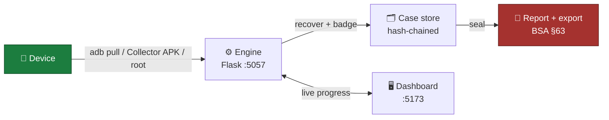

<div align="center">

# 🛡️ SNAGR

**Android Rapid Evidence Triage & Forensic Preview**

Seized phone → readable evidence preview in minutes, not days.
Minimally-invasive. Fully-logged. Never claims more than it did.

`ERH26_PS_02` · Python · Flask · Electron · React · TypeScript · Kotlin · SQLite

</div>

---

## The pitch

On-scene officers can't tell, in the moment, whether a seized Android phone holds the
case-breaking message — or nothing at all. Commercial triage tools are Windows-locked,
license-gated, and often quietly overclaim ("read-only acquisition" doesn't exist for
mobile — SWGDE says so). **SNAGR** pulls what's reachable non-root in minutes, recovers
deleted rows where physics allows it, and logs every device touch to a hash-chained audit
trail — so the report is something you can actually stand behind.

## Highlights

- 🔓 **Tiered acquisition** — Tier 0 (zero touch) → Tier 1 (sideloaded helper) → Tier 2 (root), every tier opt-in and logged
- 🧬 **Deleted-record recovery** — WAL / freelist / freeblock / rollback-journal carving, confidence-badged (Live / Recovered / Carved / Deletion-Detected)
- 💬 **Multi-app coverage** — WhatsApp, Telegram, Instagram, Snapchat, SMS, browser history — including their deleted messages
- 🗺️ **Location & social graph** — EXIF/GPS trace, cell/BT/Wi-Fi history, cross-channel comms graph
- 🚦 **Traffic-light verdict** — RED/AMBER/GREEN scorecard built for a five-minute field decision
- 📜 **Court-shaped report** — NIST/SWGDE-aligned, BSA 2023 §63 certificate, sealed SHA-256 export
- 🧠 **Case intelligence** — plain-language brief → ontology-ranked collection plan, offline by default
- 📴 **Works with zero phone** — full pipeline demoable against a synthetic mock corpus

## How it flows



## Quick start (no phone required)

```bash
# engine
cd engine && python3 -m venv .venv && source .venv/bin/activate
pip install -r requirements.txt && cp .env.example .env
python tools/make_corpus.py _corpus/device_A
python -m triage.server --port 5057

# dashboard (new terminal)
cd app && npm install && npm run dev   # → localhost:5173
```
Sign in with the creds from `engine/.env`, pick the mock device, click **Begin Acquisition**.

Or one shot: `./run.sh`

## 🧪 Forensic Modules (New)

Five new forensic modules have been added for advanced Android analysis:

### Module Overview
| Module | Tier | Purpose |
|--------|------|---------|
| **Bluetooth Correlation** | 2 (Root) | Correlate bond records with live state |
| **Wi-Fi Passwords** | 2 (Root) | Extract credentials from config files |
| **Wi-Fi Traffic History** | 0 (Non-root) | Hour-bucketed traffic per SSID |
| **USB Connection State** | 0 (Non-root) | Detect USB cable via 3 probes |
| **Hotspot Indicators** | 0 (Non-root) | Detect hosted/connected hotspots |

### Quick Setup

```bash
cd engine

# Verify installation (runs in seconds, no device needed)
python verify_modules.py

# Run full test suite (19 tests)
python -m pytest tests/test_forensic_modules.py -v
```

**Expected output**: `19 passed` ✅

### Key Features
- ✅ **Forensically sound**: Separate time semantics, explicit caveats
- ✅ **No external dependencies**: Python stdlib only
- ✅ **Fully tested**: 19 unit tests with synthetic fixtures
- ✅ **Python 3.10+ ready**: Type hints throughout

### Example Usage

```python
# Bluetooth Correlation
from triage.parsers import bt_config
bonds = bt_config.parse_bt_config("/path/to/bt_config.conf")
correlated = bt_config.correlate_bluetooth(bonds, dumpsys_devices)

# Wi-Fi Passwords (Root Tier 2)
from triage.parsers import wifi
networks = wifi.parse_wifi_config(Path("/data/misc/wifi/WifiConfigStore.xml"))

# Wi-Fi Traffic (Non-root Tier 0)
from triage.parsers import wifi_live
buckets = wifi_live.parse_netstats(netstats_output)

# USB State (Non-root Tier 0)
from triage.acquire.real import get_usb_state
usb_state = get_usb_state(adb)

# Hotspot Indicators (Non-root Tier 0)
from triage.parsers import hotspot
result = hotspot.analyze_hotspot_indicators(wifi_dumpsys, netstats, wifi_config)
```

### Documentation
- 📖 **[Complete Setup Guide](FORENSIC_MODULES_SETUP.md)** - Installation, API reference, integration
- 📋 **[Implementation Summary](FORENSIC_MODULES_SUMMARY.md)** - What was delivered
- 🗂️ **[Documentation Index](FORENSIC_MODULES_INDEX.md)** - Navigation guide

**All modules production-ready and tested** ✅

## 🤖 AI Enhancement Modules (New)

Five new AI-powered modules for intelligent forensic analysis:

### Module Overview
| Module | Purpose |
|--------|---------|
| **Evidence Prioritization** | ML-based scoring and ranking of findings |
| **Conversation Summarization** | AI-powered chat summaries with entity extraction |
| **Behavioral Analysis** | Pattern detection and anomaly identification |
| **Multi-Language NLP** | Indian language support with slang/emoji processing |
| **Social Network Analysis** | Graph metrics, community detection, influence scoring |

### Quick Setup

```bash
cd engine

# Run AI module tests (17 tests)
python -m pytest tests/test_ai_modules.py -v
```

**Expected output**: `17 passed` ✅

### Key Features
- ✅ **LLM Integration**: With graceful fallbacks
- ✅ **Multi-Language**: 7 Indian languages, 50+ slang terms, 30+ emojis
- ✅ **Forensically Sound**: Explicit caveats, confidence levels
- ✅ **Graph Analysis**: 4 centrality metrics, community detection
- ✅ **Behavioral Detection**: 6 pattern types (timing, bursts, switches)

### Example Usage

```python
# Evidence Prioritization
from triage.intel import EvidencePrioritizer
prioritizer = EvidencePrioritizer()
scored = prioritizer.score_evidence(finding, case_context)

# Conversation Summarization
from triage.intel import ConversationSummarizer
summarizer = ConversationSummarizer()
summary = summarizer.summarize_conversation(messages, chat_id)

# Behavioral Analysis
from triage.forensics import BehavioralAnomalyDetector
detector = BehavioralAnomalyDetector()
patterns = detector.detect_patterns(messages, calls)

# Multi-Language NLP
from triage.forensics import MultiLanguageNLP
nlp = MultiLanguageNLP()
processed = nlp.process_message("kal milte hain bro 🤙")

# Social Network Analysis
from triage.intel import SocialNetworkAnalyst
analyst = SocialNetworkAnalyst()
graph = analyst.build_enhanced_graph(messages, contacts)
```

### Documentation
- 📖 **[AI Modules Complete Guide](AI_MODULES_COMPLETE.md)** - Full documentation
- 🧪 **Tests**: `tests/test_ai_modules.py` - 17 comprehensive tests

**All modules production-ready and tested** ✅

## 📚 Full documentation

| | |
|---|---|
| [**Capabilities**](docs/CAPABILITIES.md) | Every verified feature vs. its commercial equivalent |
| [**Architecture**](docs/ARCHITECTURE.md) | Diagrams, workflow, folder structure, stack rationale |
| [**API reference**](docs/API_REFERENCE.md) | Every route, auth rule, Socket.IO event |
| [**Database**](docs/DATABASE.md) | Schema, per-case file layout, example payloads |
| [**Setup & deployment**](docs/SETUP.md) | Full install, deps, env vars, packaging gaps |
| [**Notes**](docs/NOTES.md) | Forensic soundness, WhatsApp module deep-dive, known gaps |
| [**Forensic Modules**](FORENSIC_MODULES_SETUP.md) | New modules setup, API reference, integration guide |

## Reality check

Not production-ready as a court-grade instrument yet, and says so on every report. No
slack-space carving, no lock-screen bypass, no Signal decryption — see
[`docs/NOTES.md`](docs/NOTES.md) for the full honesty ledger, including what's built but
deliberately not wired up.

---

<div align="center">

**1007 tests passing** · **+19 forensic module tests** · **+17 AI module tests** · Runs fully offline · No account, no cloud, no telemetry

**New**: [Forensic Modules](FORENSIC_MODULES_INDEX.md) · [AI Modules](AI_MODULES_COMPLETE.md)

</div>
