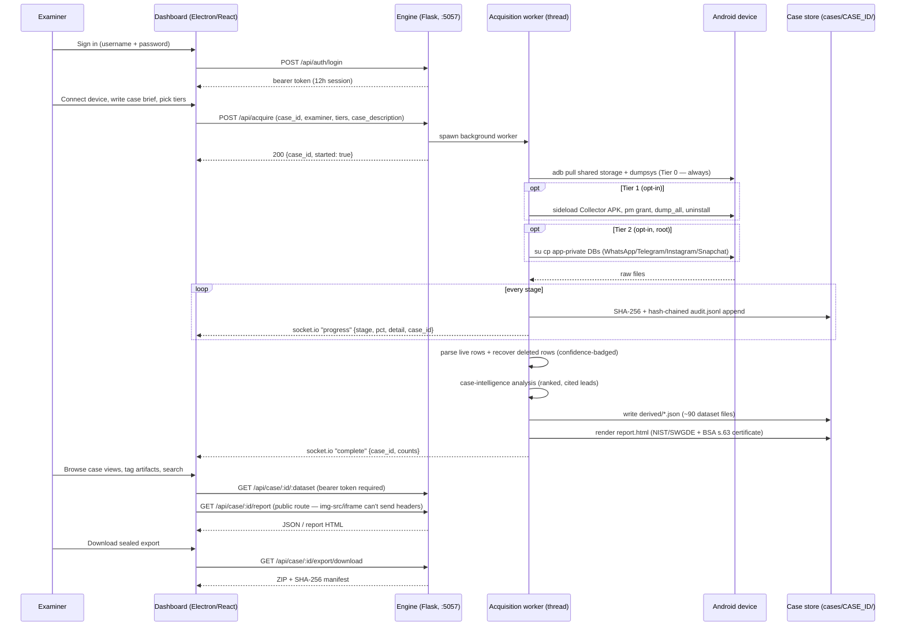
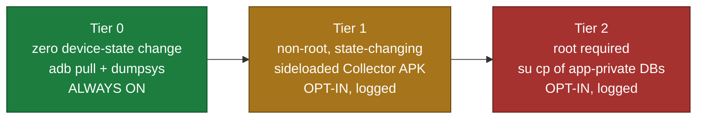
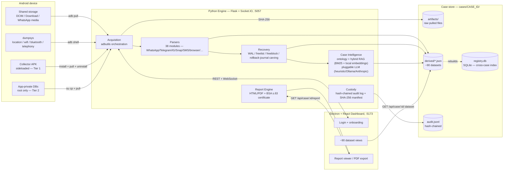

# Architecture

[← back to README](../README.md)

## End-to-end workflow

The full path from "plug in a phone" to "sealed, court-formatted evidence package":



Escalating invasiveness is the core abstraction — every artifact is tagged with the tier
that produced it, and Tier 1/2 are opt-in with every skip logged with a reason:



## System architecture



**Why this stack:**
- **Electron + React/TS, not Next.js** — a native desktop tool needs direct USB/ADB access,
  must run fully offline in an interrogation room, and packages as a standalone executable.
- **Python/Flask as the engine, not Node/Go** — every forensic library that matters here
  (ALEAPP, SQLite carving, `adbutils`) is Python or trivially subprocess-callable from it.
- **Per-case SQLite/JSON on disk, no server database** — the tool has to work with zero
  network dependency at a crime scene. `registry.db` is a rebuildable cache, not the source
  of truth — the case folder is. Full schema: [`docs/DATABASE.md`](DATABASE.md).

## Project folder structure

```
Digital forensic tool/
├── README.md                      # top-level pitch + quick start
├── run.sh                         # one-command demo launcher (venv + corpus + engine + dashboard)
├── DEMO_CHECKLIST.md / ps02_team_roadmap.md
├── docs/
│   ├── IMPLEMENTATION_PLAN.md     # 30-day plan + feasibility research
│   ├── CAPABILITIES.md / ARCHITECTURE.md / API_REFERENCE.md / DATABASE.md / SETUP.md / NOTES.md
│
├── engine/                        # Python forensic engine (the core)
│   ├── requirements.txt
│   ├── .env.example                # copy → .env for SNAGR_AUTH_USER/PASS
│   ├── docs/PRODUCTION_READINESS.md
│   ├── tools/                      # make_corpus.py + corpus_shell.py (canned dumpsys) + 4 more
│   ├── tests/                      # pytest suite — 1007 tests
│   ├── security/ analytics/ integration/ advanced_forensics/   # ⚠ present, fabrication stubs — see NOTES.md
│   └── triage/                     # the actual engine package
│       ├── server.py               # Flask + Socket.IO app, all API routes
│       ├── pipeline.py             # stage orchestration — run_acquisition()
│       ├── capabilities.py         # per-dataset state: populated/empty/not_collected/inaccessible/planned
│       ├── custody.py              # Case class — chain-of-custody, audit, manifest
│       ├── registry.py             # cross-case SQLite registry
│       ├── config.py / models.py / cli.py / adb.py / hashing.py
│       ├── acquire/                # base.py, mock.py, real.py — acquisition backends
│       ├── parsers/                # 38 files — whatsapp_db.py, telegram.py, instagram.py, snapchat.py, sms.py, wifi.py, exif.py …
│       ├── recovery/                # deep_sqlite.py, sqbrite.py, sqlite_recovery.py
│       ├── forensics/               # 48 files — audit_chain.py, bsa_certificate.py, comm_graph.py, hash_verification.py …
│       ├── intel/                   # llm.py, embeddings.py, planner.py, ontology.py, knowledge_graph.py, casebank.py,
│       │                           # investigator.py (deep investigation), case_qa.py (ask-this-case) + data/case_studies.jsonl
│       ├── report/                  # html_report.py, exporter_pdf.py, exporter_word.py, exporter_csv.py
│       ├── validation/              # cftt.py, harness.py, swgde.py — self-validation harness
│       └── notifications/           # email/SMS/Slack/Teams — real, wired to run_acquisition() (opt-in)
│
├── app/                            # Electron + React + TypeScript + Tailwind dashboard
│   ├── package.json / vite.config.ts / tailwind.config.js
│   ├── electron/                    # main.cjs, preload.cjs, pdf/pdfRenderer.cjs (Playwright)
│   └── src/
│       ├── App.tsx / main.tsx / index.css
│       ├── components/              # Sidebar.tsx, ChatView.tsx, GlobalSearch.tsx, RiskCard.tsx …
│       ├── lib/                     # api.ts (fetch client + auth), capabilities.tsx, hooks.ts, types.ts, tagStore.tsx
│       └── views/                   # 48 files — one per dataset (Overview, Messages, Locations, Report, Login, Onboarding,
│                                   # AskTheCase …)
│
└── apk/                             # Kotlin "Collector" Tier-1 helper APK
    ├── build.gradle / settings.gradle / gradlew
    ├── gradle/wrapper/gradle-wrapper.properties   # Gradle 8.9
    └── app/
        ├── build.gradle             # compileSdk 34 · minSdk 26 · targetSdk 34
        └── src/main/java/io/erakshak/collector/   # package id unchanged — see NOTES.md
            ├── MainActivity.kt
            ├── CommsCollectors.kt / MediaCollector.kt / LocationCollectors.kt
            ├── NotificationCollector.kt / SystemCollectors.kt / StorageWriter.kt
            └── KnownApps.kt / CollectionResult.kt
```

> **Path gotcha:** the repo root directory name ends with a literal space
> (`Digital forensic tool `, space before the closing quote). Always quote it in shell
> commands: `cd "/path/to/Digital forensic tool "`.
